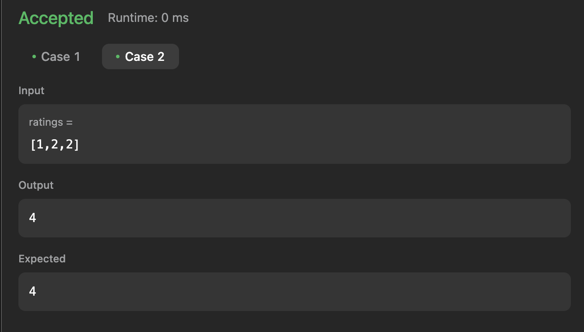
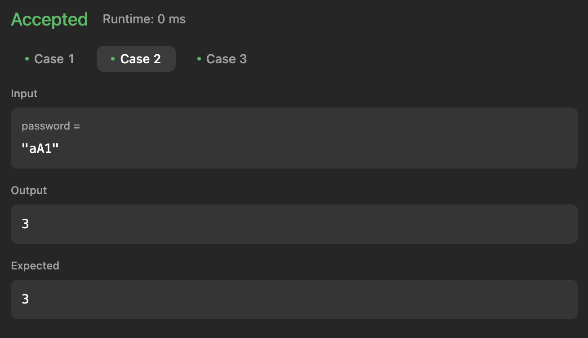

# Execícios do Leetcode

**Número da Lista**: 4<br>

**Conteúdo da Disciplina**: Algoritmos Ambiciosos<br>

## Alunos
| Matrícula | Aluno                     |
| --------- | ------------------------- |
| 200054333 | Arthur Gabriel Lima Gomes |
| 211061350 | Alexandre de Santana Beck |

## Sobre

Este projeto tem como objetivo resolver questões do [LeetCode](https://leetcode.com/problemset/?search=graph&page=1&sorting=W3t9XQ%3D%3D) sobre Algoritmos Ambiciosos utilizando a linguagem de programação JavaScript. Abaixo, estão listadas as questões selecionadas, com seus respectivos níveis de dificuldade e vídeos explicativos da resolução.

## Questões

| Nome                                                                                                                                     | Nível   |
| ---------------------------------------------------------------------------------------------------------------------------------------- | ------- |
| [134. Gas Station](https://leetcode.com/problems/gas-station/description/?envType=problem-list-v2&envId=greedy)                          | Médio   |
| [135. Candy](https://leetcode.com/problems/candy/description/?envType=problem-list-v2&envId=greedy)                                      | Dificil |
| [420. Strong Password Checker](https://leetcode.com/problems/strong-password-checker/description/?envType=problem-list-v2&envId=greedy)  | Dificil |

## Video

[Vídeo]()

## Screenshots

### [134. Gas Station](https://leetcode.com/problems/gas-station/description/) 

 **Caso 1:**

 

 **Caso 2:**

 


## Screenshots

### [135. Candy](https://leetcode.com/problems/candy/description/?envType=problem-list-v2&envId=greedy)

 **Caso 1:**

 


 **Caso 2:**

 

## Screenshots
    
### [420. Strong Password Checker](https://leetcode.com/problems/strong-password-checker/description/)

 **Caso 1:**

 


 **Caso 2:**

 

 **Caso 3:**

 

## Uso

Para executar as soluções, você pode colar o código diretamente no LeetCode ou criar casos de teste na função ```main``` do arquivo.
